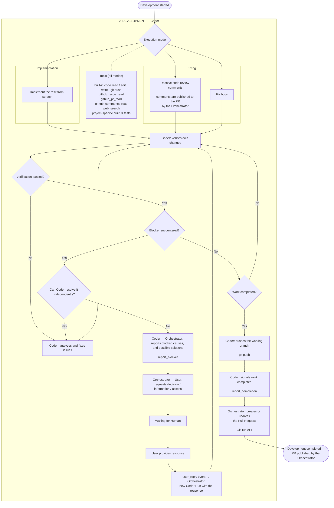

```mermaid
flowchart TB
    START(["Development started"])

    subgraph DEVELOPMENT["2. DEVELOPMENT — Coder"]
        direction TB

        D1{"Execution mode"}

        D1 -.- T0["Tools (all modes)<br/><br/>built-in code read / edit / write · git push<br/>github_issue_read<br/>github_pr_read<br/>github_comments_read<br/>web_search<br/>project-specific build &amp; tests"]

        subgraph IMPLEMENTATION["Implementation"]
            I1["Implement the task from scratch"]
        end

        subgraph FIXING["Fixing"]
            F1["Resolve code review comments<br/><br/>comments are published to the PR<br/>by the Orchestrator"]
            F2["Fix bugs"]
        end

        D1 --> I1
        D1 --> F1
        D1 --> F2

        I1 --> V1
        F1 --> V1
        F2 --> V1

        V1["Coder: verifies own changes"]
        V1 --> V2{"Verification passed?"}

        V2 -- "No" --> V3["Coder: analyzes and fixes issues"]
        V3 --> V1

        V2 -- "Yes" --> V4{"Blocker encountered?"}

        V4 -- "Yes" --> V5{"Can Coder resolve it independently?"}
        V5 -- "Yes" --> V3
        V5 -- "No" --> V6["Coder → Orchestrator: reports blocker, causes, and possible solutions<br/><br/>report_blocker"]
        V6 --> V7["Orchestrator → User: requests decision / information / access"]
        V7 --> V8["Waiting for Human"]
        V8 --> V9["User provides response"]
        V9 --> V10["user_reply event → Orchestrator:<br/>new Coder Run with the response"]
        V10 --> V1

        V4 -- "No" --> V11{"Work completed?"}
        V11 -- "No" --> V1
        V11 -- "Yes" --> V12["Coder: pushes the working branch<br/><br/>git push"]
        V12 --> V13["Coder: signals work completed<br/><br/>report_completion"]
        V13 --> V14["Orchestrator: creates or updates<br/>the Pull Request<br/><br/>GitHub API"]
    end

    START --> D1
    V14 --> NEXT(["Development completed —<br/>PR published by the Orchestrator"])
```

> Every Coder Run ends with `report_completion`. Iteration caps and no-progress handling
> are Orchestrator policy — not part of this flow.
