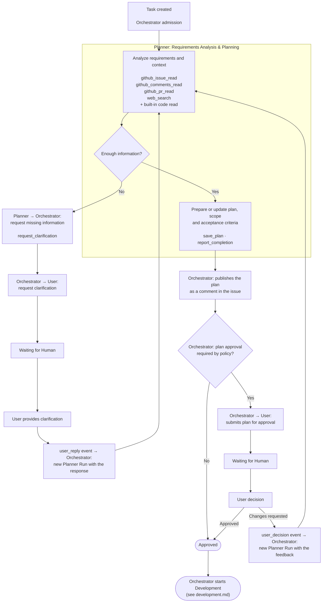

```mermaid
flowchart TD
    A["Task created<br/><br/>Orchestrator admission"] --> P1

    subgraph PL["Planner: Requirements Analysis & Planning"]
        direction TD
        P1["Analyze requirements and context<br/><br/>github_issue_read<br/>github_comments_read<br/>github_pr_read<br/>web_search<br/>+ built-in code read"]
        P1 --> Q{"Enough information?"}
        Q -->|Yes| P2["Prepare or update plan, scope<br/>and acceptance criteria<br/><br/>save_plan · report_completion"]
    end

    Q -->|No| C1["Planner → Orchestrator:<br/>request missing information<br/><br/>request_clarification"]
    C1 --> C2["Orchestrator → User:<br/>request clarification"]
    C2 --> W1["Waiting for Human"]
    W1 --> U1["User provides clarification"]
    U1 --> C3["user_reply event → Orchestrator:<br/>new Planner Run with the response"]
    C3 --> P1

    P2 --> PUB["Orchestrator: publishes the plan<br/>as a comment in the issue"]
    PUB --> AP{"Orchestrator: plan approval<br/>required by policy?"}

    AP -->|No| DONE(["Approved"])
    AP -->|Yes| S1["Orchestrator → User:<br/>submits plan for approval"]
    S1 --> W2["Waiting for Human"]
    W2 --> U2["User decision"]

    U2 -->|Approved| DONE
    U2 -->|Changes requested| F1["user_decision event → Orchestrator:<br/>new Planner Run with the feedback"]
    F1 --> P1

    DONE --> DEV(["Orchestrator starts Development<br/>(see development.md)"])
```

> Every Planner Run ends with `report_completion`. The plan-approval requirement (AP) is
> the Orchestrator's policy decision — not part of this flow.
