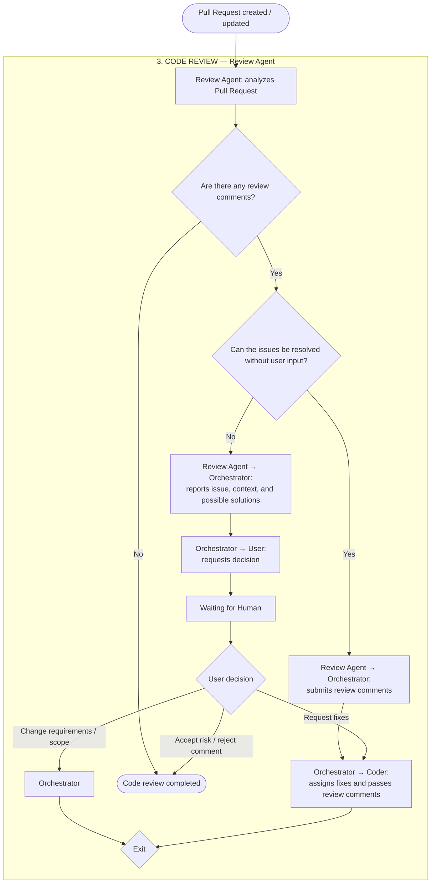

```mermaid
flowchart TB
START(["Pull Request created / updated"])

subgraph REVIEW["3. CODE REVIEW — Review Agent"]
    direction TB

    R1["Review Agent: analyzes Pull Request"]
    R2{"Are there any review comments?"}
    R3{"Can the issues be resolved without user input?"}

    R4["Review Agent → Orchestrator:<br/>submits review comments"]
    R5["Orchestrator → Coder:<br/>assigns fixes and passes review comments"]

    R6["Review Agent → Orchestrator:<br/>reports issue, context, and possible solutions"]
    R7["Orchestrator → User:<br/>requests decision"]
    R8["Waiting for Human"]
    R9{"User decision"}
    EXIT{"Exit"}

    R1 --> R2
    R2 -- "No" --> DONE(["Code review completed"])
    R2 -- "Yes" --> R3

    R3 -- "Yes" --> R4 --> R5
    R3 -- "No" --> R6 --> R7 --> R8 --> R9

    R9 -- "Request fixes" --> R5
    R9 -- "Change requirements / scope" --> ORCH["Orchestrator"]
    R9 -- "Accept risk / reject comment" --> DONE
    ORCH --> EXIT
    R5 --> EXIT
    end

START --> R1
```