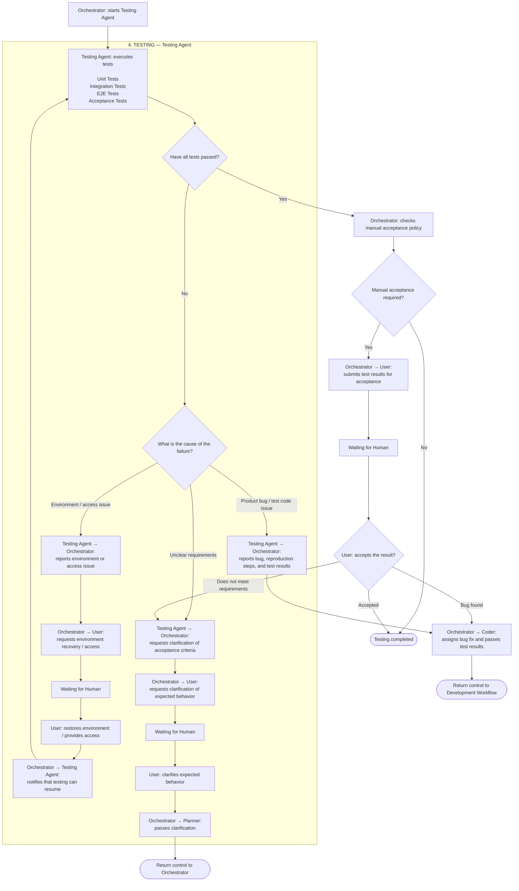

```mermaid
flowchart TB
    ORCH_START["Orchestrator: starts Testing Agent"]

    subgraph TESTING["4. TESTING — Testing Agent"]
        direction TB

        T1["Testing Agent: executes tests<br/><br/>Unit Tests<br/>Integration Tests<br/>E2E Tests<br/>Acceptance Tests"]

        T2{"Have all tests passed?"}
        T3{"What is the cause of the failure?"}

        T4["Testing Agent → Orchestrator:<br/>reports bug, reproduction steps, and test results"]

        T5["Testing Agent → Orchestrator:<br/>reports environment or access issue"]
        T6["Orchestrator → User:<br/>requests environment recovery / access"]
        T7["Waiting for Human"]
        T8["User: restores environment / provides access"]
        T9["Orchestrator → Testing Agent:<br/>notifies that testing can resume"]

        T10["Testing Agent → Orchestrator:<br/>requests clarification of acceptance criteria"]
        T11["Orchestrator → User:<br/>requests clarification of expected behavior"]
        T12["Waiting for Human"]
        T13["User: clarifies expected behavior"]
        T14["Orchestrator → Planner:<br/>passes clarification"]

        T1 --> T2
        T2 -- "No" --> T3

        T3 -- "Product bug / test code issue" --> T4
        T3 -- "Environment / access issue" --> T5
        T5 --> T6 --> T7 --> T8 --> T9 --> T1

        T3 -- "Unclear requirements" --> T10
        T10 --> T11 --> T12 --> T13 --> T14
    end

    ORCH_START --> T1

    T4 --> O1["Orchestrator → Coder:<br/>assigns bug fix and passes test results"]
    O1 --> EXIT1(["Return control to Development Workflow"])

    T14 --> EXIT2(["Return control to Orchestrator"])

    T2 -- "Yes" --> O2["Orchestrator: checks manual acceptance policy"]
    O2 --> O3{"Manual acceptance required?"}

    O3 -- "No" --> DONE(["Testing completed"])
    O3 -- "Yes" --> O4["Orchestrator → User:<br/>submits test results for acceptance"]
    O4 --> O5["Waiting for Human"]
    O5 --> O6{"User: accepts the result?"}

    O6 -- "Accepted" --> DONE
    O6 -- "Bug found" --> O1
    O6 -- "Does not meet requirements" --> T10
```